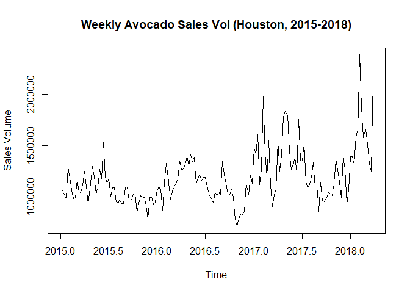
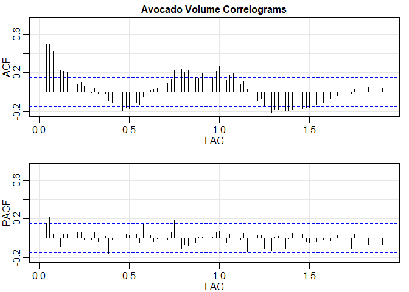
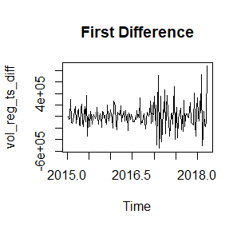
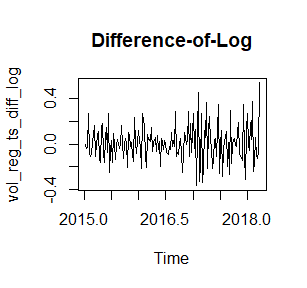
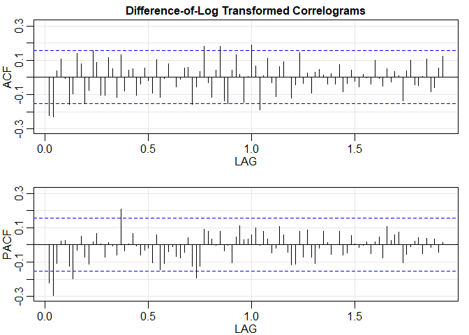
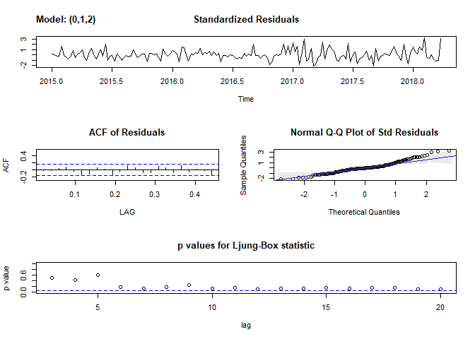
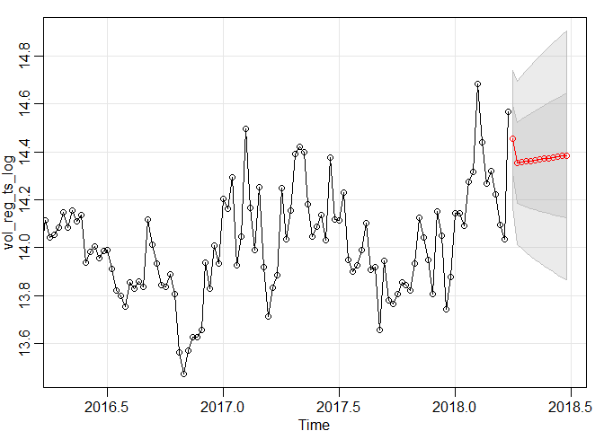

Time Series Analysis of Avocado Sales in Houston, Texas
================
Team9: Rebecca Crawford, Elisabeth McGowen, and Kathryn Sinders
December 1, 2018

Introduction
------------

Recently deemed a highly nutritious superfood, the avocado is a savory green fruit coveted by many Americans. The avocado fares well in warm climates, a seasonal constraint that historically explained avocad o scarcity in US winters. Mexico has evaded this constraint, as its warm climate is conducive to growing and harvesting the fruit year round. In 1914, Mexican avocado imports to the United States were banned due to phytosanitary issues and competing growers in California. The ban was eventually lifted in 1994, following the enaction of the North American Free Trade Agreement (NAFTA). Shortly thereafter, the fruit became available in US supermarkets year round.

Following the emergence of the American superfood trend, this annually accesssible fruit has recently skyrocketed in popularity, with 9 million instances of \#avocado trending on Instagram at any given time (*\#Avocado*). According to Mike Knowles of *Fruit Logistica*, crafty marketing is also responsible for the fruit's upsurge. In fact, the avocado is the only type of produce that has ever been advertised during the superbowl (Ferdmen). The *Latest Fruit Market Trending Data* from the Hass Avocado Board reports that avocado sales volume reached a national 35.5% growth in the quarter ending July 1, 2018. Americans currently consume 7 pounds of avocados per person each year as compared to about one pound each in 1989 (Handwerk).

***Problem***

Avocado sales data were obtained from kaggle.com (Kiggins). The file contained the weekly average volumes of conventional avocados in cities across the United States. Based on our research, we hypothesized that avocado sales volume would continue to rise in Houston.

***Purpose***

To guide retailers, investors, and consumers toward profitable and affordable solutions, it would be to useful to forecast future values of avocado volumes. Controlling volume, and consequently price, is especially crucial in Mexico's neighboring regions, particularly in Houston, TX where obesity and cardiovascular diseases are prevalent among the poor. Thus, the ultimate goal of this analysis was to forecast future values of avocado volume. Using the Box-Jenkins method, this process would entail stationarizing, proposing ARIMA(p,d,q) candidates based on autocorrelations, estimating parameters, evaluating subsequent models, and forecasting future values for the series.

Results and Discussion
----------------------

The timeframe for the 169 weekly observations for average Avocado volume ranged from January 4, 2015 to March 25, 2018. To create a time series object from the file, we selected only our desired sales volume variable and date, and utilized the ts( ) function with a frequency of 52.

***Data Exploration***

The original time series is plotted below:



As illustrated in the above plot, avocado sales volume appeared non-stationary. Avocado volume remained moderately constant from 2015 until late 2016/early 2017. From then onward, the series fluctuated, exhibiting slightly more variability. A steep, upward trend emerged just before 2018, followed by a sharp decline immediately thereafter. We surmised that a stationary series could be attained through the following two transformations. The trends could be eliminated through differencing while a natural logarithm transformation might stabilize the non-constant variance. Before manipulating the data, however, the ACF and PACF were plotted and examined.



    ## numeric(0)

As anticipated, the ACF decayed gradually, thus confirming non-stationarity. The ACF also appeared to exhibit slightly cyclical behavior, oscillating between marginally significant negative and positive values roughly every 0.5 increments (half a year) as it gradually tailed off. Before addressing potential seasonality, however, the data still needed to be stationarized.

***Stationarizing***

As previously stated, the two violations of stationarity conditions called for both types of transformations: the logarithm transformation and the first difference. Both transformations were applied, and the plots of the resulting time series are shown below:



While the plots for both series were fairly similar, the difference-of-log series appeared to have a more constant variance as evidenced by the following observation: the range of values in the first half more closely resembled that of the second half. Based on its apparent improved stationarity, the difference-of-log transformed series was used in our proceeding analysis. Analysis of PACF and ACF plots for each transformation further reaffirmed this decision (as shown below in the .Rmd file).



    ## numeric(0)

The ACF above confirms that the series has been stationarized. There does not seem to be any evidence of seasonality since nearly every ACF and PACF value after lag = 2 is statistically insignificant. There are a few values that extend past the confidence bounds, but we would argue that this is most likely due to noise in the data since there is no distinguishable pattern. We also assessed seasonality of the data using ggseasonplot( ) and ggmonthplot( ), but found no evidence of seasonality (in .Rmd file).

In accordance with the Box-Jenkins method, we examined the behavior of the ACF and PACF of the series and compared it to the general expectations for known ARMA(p,q) classes. The ACF and the PACF plots resembled one another, and both could arguably have been exhibiting either one of the following two behaviors: a cut-off after the second lag or a tail-off. It was difficult to assess the signficance of lags that extended only slightly beyond the confidence bounds in each plot. If we had interpreted both as cutting off after lag = 2, then an MA(2) model (or equivalently, an ARIMA(0,1,2) for the *un*differenced, log-transformed data) would be optimal. If we had instead interpreted the ACF as tailing off and the PACF as cutting off, then an AR(2) model (or an ARIMA(2,1,0) for the *un*differenced, log-transformed data) would be a reasonable proposition. Finally, if we had interpreted *both* ACF and PACF as tailing off, then an ARIMA(p,d,q) model would be the prime candidate. We examined the EACF for this third model and found that the order should be ARIMA(1,1,2). Consequently, three potential candidates emerged:

***Model Fitting***

As mentioned previously, our three candidates were:

-Candidate \#1: ARIMA(0,1,2)

-Candidate \#2: ARIMA(2,1,0)

-Candidate \#3: ARIMA(1,1,2)

In accordance with Box-Jenkins, parameters were estimated for the candidate classes proposed and the resulting models' standardized residuals were analyzed to evaluate goodness-of-fit. We utilized the sarima( ) function to assess diagnostics for all three candidates (all outputs and their interpretations can be viewed in .Rmd file) and ultimately selected the non-constant model esimated for Candidate \#1 as our final model. The Ljung-Box statistics plot, QQ-plots, and residual correlograms supplied by sarima( ) were examined to determine whether assumptions had been violated for this model or if any of the model's residuals were autocorrelated. The outputted plots are displayed below:

``` r
#Constant was revealed to be insignificant, so here we are applying no.constant = TRUE.

#We are also applying this differencing model to the log-transformed data.

sarima(vol_reg_ts_log, 0, 1, 2, no.constant = TRUE)
```

    ## initial  value -1.867215 
    ## iter   2 value -1.940268
    ## iter   3 value -1.945080
    ## iter   4 value -1.948044
    ## iter   5 value -1.948377
    ## iter   6 value -1.948395
    ## iter   7 value -1.948396
    ## iter   8 value -1.948396
    ## iter   8 value -1.948396
    ## iter   8 value -1.948396
    ## final  value -1.948396 
    ## converged
    ## initial  value -1.947356 
    ## iter   2 value -1.947366
    ## iter   3 value -1.947370
    ## iter   4 value -1.947370
    ## iter   4 value -1.947370
    ## iter   4 value -1.947370
    ## final  value -1.947370 
    ## converged



    ## $fit
    ## 
    ## Call:
    ## stats::arima(x = xdata, order = c(p, d, q), seasonal = list(order = c(P, D, 
    ##     Q), period = S), include.mean = !no.constant, optim.control = list(trace = trc, 
    ##     REPORT = 1, reltol = tol))
    ## 
    ## Coefficients:
    ##           ma1      ma2
    ##       -0.3416  -0.2375
    ## s.e.   0.0784   0.0838
    ## 
    ## sigma^2 estimated as 0.02031:  log likelihood = 88.78,  aic = -171.55
    ## 
    ## $degrees_of_freedom
    ## [1] 166
    ## 
    ## $ttable
    ##     Estimate     SE t.value p.value
    ## ma1  -0.3416 0.0784 -4.3596  0.0000
    ## ma2  -0.2375 0.0838 -2.8353  0.0051
    ## 
    ## $AIC
    ## [1] -2.873097
    ## 
    ## $AICc
    ## [1] -2.860402
    ## 
    ## $BIC
    ## [1] -3.836056

The time plot of the residuals did not indicate any obvious pattern, and most autocorrelations remained within the confidence bounds for all lags. Although some of the Q-Q plot points *were* outside of the confidence bounds, this plot displayed the closest distribution to normal of the three by far. Finally, the p-values for all Ljung-Box statistics exceeded *α* = 0.05. Thus we felt strongly that this was a good candidate. Next, we compared the AIC, AICc, and BIC of all three models for additional confirmation.

    ##      ARIMA(0,1,2) ARIMA(2,1,0) ARIMA(1,1,2)
    ## [1,]    -2.873097    -2.865438    -2.862015
    ## [2,]    -2.860402    -2.852743    -2.848737
    ## [3,]    -3.836056    -3.828397    -3.806454

As shown in the above matrix, all information criterias preferred the ARIMA(0,1,2) model, and we agreed. In terms of the volume series, *x*<sub>*t*</sub>, this model can be expressed algebraically as:

*l**n*(*x*<sub>*t*</sub>)−*l**n*(*x*<sub>*t* − 1</sub>)=*w*<sub>*t*</sub> − 0.3416*w*<sub>*t* − 1</sub> − 0.2375*w*<sub>*t* − 2</sub>

*where *w*<sub>*t*</sub> is uncorrelated, white noise and ln denotes the natural logarithm, or logarithm with base e. *

***Forecasting***

To ensure our model was sufficient, we analyzed the forecasted values for the next quarter (13 weeks).

``` r
sarima.for(vol_reg_ts_log, 13, 0, 1, 2)
```



    ## $pred
    ## Time Series:
    ## Start = c(2018, 14) 
    ## End = c(2018, 26) 
    ## Frequency = 52 
    ##  [1] 14.45653 14.35396 14.35678 14.35961 14.36243 14.36525 14.36808
    ##  [8] 14.37090 14.37373 14.37655 14.37937 14.38220 14.38502
    ## 
    ## $se
    ## Time Series:
    ## Start = c(2018, 14) 
    ## End = c(2018, 26) 
    ## Frequency = 52 
    ##  [1] 0.1423435 0.1702815 0.1802663 0.1897263 0.1987365 0.2073556 0.2156304
    ##  [8] 0.2235992 0.2312937 0.2387402 0.2459615 0.2529766 0.2598024

The above plot illustrated how, based on our model, avocado sales in the Houston area would be expected to remain on the higher end of the trend over the next quarter. This seemed consistent with our research, and in support of our hypothesis.

Conclusion
----------

Using the Box-Jenkins method, the best possible class for the optimal model was an ARIMA(0,1,2) applied to the log transformed, undifferenced data. The parameter estimates for the ARIMA(0,1,2) proposed by sarima( ) were $\\hat\\theta\_1 = -0.3416$, $\\hat\\theta\_2 = -0.2375$, and a constant of .0028. Both MA coefficient estimates were significant, but the constant was not, so after removing it and analyzing the residual diagnostics it was determined that among all candidates, this model was optimal because:

-No model assumptions were violated. The standardized residuals appeared stationary and the p-values for all q-statistics of the Ljung-Box Test exceeded *α* = 0.05.

-All parameter estimates were significant for *α* = 0.05.

-All information criteria favored this candidate.

Using this final model to forecast avocado sales volume for the Houston area over the next quarter resulted in values that seemed in-line with our research as they were mostly on the higher end of the trend, and seemed slightly upward in nature. While we felt confident about this model, we would like to emphasize that the accuracy of our forecast remains to be seen. It is important that this analysis be revisited frequently as more data becomes available, and that the forecasting model be modified accordingly.

------------------------------------------------------------------------

References
----------

*\#Avocado*. Instagram. Retrieved from <https://www.instagram.com/explore/tags/avocado/?hl=en>.

*Avocado Recipes*. Google. Retrieved from <https://www.google.com/search?q=avocado+recipe&oq=avocado+re&aqs=chrome.0.69i59j0j69i57j69i60l3.1944j0j7&sourceid=chrome&ie=UTF-8>.

*Commodity: Avocados.* Produce Market Guide. Retrieved from <https://www.producemarketguide.com/produce/avocados>.

Ferdman, Roberto A. (2015, Jan). *The Rise of the Avocado, America's New Favorite Fruit.* The Washington Post. Retrieved from <https://www.washingtonpost.com/news/wonk/wp/2015/01/22/the-sudden-rise-of-the-avocado-americas-new-favorite-fruit/?utm_term>=.5187d0527886.

Handwerk, Brian. (2017, Jul). *Holy Guacamole: How the Hass Avocado Conquered the World.* Smithsonian.com. Retrieved from <https://www.smithsonianmag.com/science-nature/holy-guacamole-how-hass-avocado-conquered-world-180964250/>.

Karst, Tom. (2018, Jan). *Villita Avocados Investing in Texas Crop.* The Packer. Retrieved from <https://www.thepacker.com/article/villita-avocados-investing-texas-crop>.

Kiggins, Justin. (2018, Jun). *Avocado Prices: Historical Data on Avocado Prices & Sales Volume in Multiple U.S. Markets.* Retrieved from <https://www.kaggle.com/neuromusic/avocado-prices/home>.

Knowles, Mike. (2017, Jun). *Why Have Avocados Become So Popular?* Fruit Logistica. Retrieved from <http://www.fruitnet.com/eurofruit/article/172578/why-have-avocados-become-so-popular>.

*Latest Fruit Market Trending Data. Hass Avocado Board. (2018).* Retrieved from <http://www.hassavocadoboard.com/retail/fruit-trending-data>.
